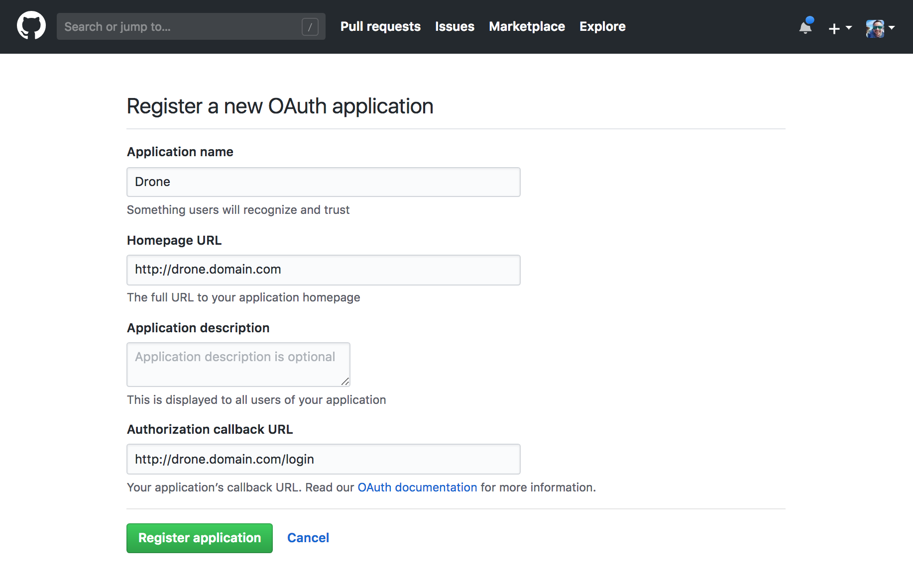
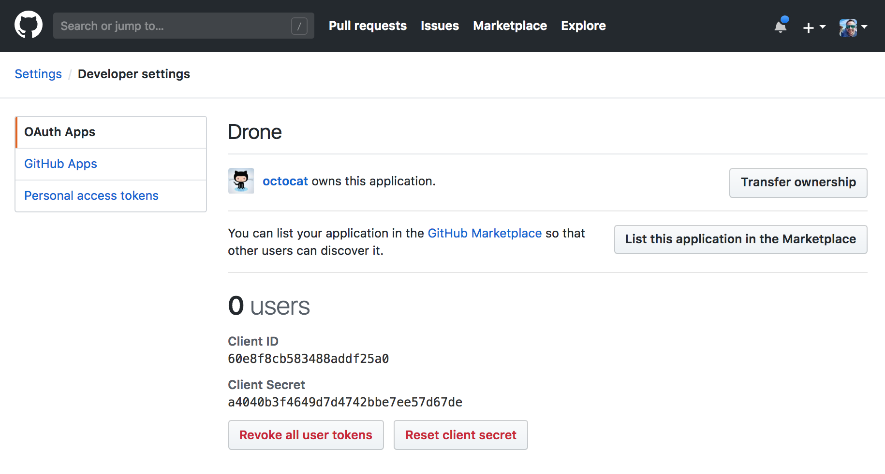

# Drone-&-Argo

Este projeto consiste em subir uma stack do ***Drone CI*** e ***Argo CD*** de maneira automatizada em um cluster Kubernetes. As ferramentas utilizadas para o funcionamento correto da stack são:

## Pré-Requisitos

Para executar este projeto, certifique-se de ter as seguintes ferramentas instaladas:

- [Kind](https://kind.sigs.k8s.io/) --> Para criação do cluster Kubernetes.
- [Kubectl](https://kubernetes.io/docs/tasks/tools/) --> Para criação e execução de manifestos no cluster.
- [Helm](https://helm.sh/docs/intro/install/) --> Para criação e instalação de helmcharts.
- [Metal-LB](https://metallb.universe.tf/installation/) --> Para recebermos um External-IP para nossos services LoadBalancer e nossos Ingress
- [Helmfile](https://helmfile.readthedocs.io/en/latest/#getting-started) --> Para instalação de todos os helmcharts de forma automatizada e versionada.

## Como rodar o projeto ?

- 1 - Instale os pré-requisitos.
- 2 - Altere o manifesto yml da pasta do Metal-LB, e instale o manifesto.
- 3 - Crie uma OAuth Application no seu Github para se autenticar no Drone.
- 4 - Crie um secret com o ID e o Secret do Github, utilizado no OAuth Application
- 5 - Altere o values.yml do Drone-Server para se autenticar na sua conta do Github.
- 6 - Suba toda a stack utilizando o Helmfile na raíz do projeto.

A explicação de cada passo do projeto, vai estar listada de forma detalhada, à partir do passo 2 abaixo.

## Passo 2

Após ter instalado o [Metal-LB](https://metallb.universe.tf/installation/) no cluster, acesso o arquivo [manifests.yaml](Metal-LB/manifests.yaml) , e edite a ***linha 8***, conforme a orientação do comentário. Após realizado o procedimento, execute o comando:

```bash
kubectl create -f Metal-LB/manifests.yaml
```

## Passo 3

Crie um GitHub ***OAuth Application***. A ***Consumer Key*** e a ***Consumer Secret*** são usadas para autorizar o acesso aos recursos do GitHub. A URL de retorno de chamada de autorização deve corresponder ao formato e caminho abaixo, e deve usar seu esquema de servidor e host exatos.




O campo ***HOMEPAGE_URL***, deve ser preenchido com a URL que você deseja utilizar para acessar seu Drone. Você pode utilizar qualquer URL, e depois seguir o passo 6 criando um Ingress de acesso, ou utilizar a ferramenta [Ngrok](https://ngrok.com/), para gerar uma URL de espelhamento específica para sua máquina.

Após termos criado o ***OAuth Application***, precismos criar um shared secret para autenticar a comunicação entre os Runners (serão instalados e utilizados no projeto de forma automatizada) e seu servidor Drone central. Para gerar um shared secret, utilizaremos o comando openssl, citado à baixo:

```bash
openssl rand -hex 16
```

## Passo 4

Crie um secret, utilizando o client e secret ID da sua conta do Github, que fora gerado através do ***OAuth Application***. Comando para gerar o secret, esta citado à baixo:

```bash
kubectl create secret my-drone-secret generic \
  --from-literal=DRONE_RPC_SECRET=$DRONE_RPC_SECRET \
  --from-literal=DRONE_GITHUB_CLIENT_ID=$DRONE_GITHUB_CLIENT_ID \
  --from-literal=DRONE_GITHUB_CLIENT_SECRET=$DRONE_GITHUB_CLIENT_SECRET -n drone --create-namespace
```
Lembrando que as variaveis devem ser alterados IDs gerados pelo OAuth da sua conta do Github.

- DRONE_RPC_SECRET --> O valor de string obrigatório fornece o segredo compartilhado gerado na etapa anterior. Isso é usado para autenticar a conexão rpc entre o servidor e os runners (após a criação deste secret, os runners já irão pegar esses dados conforme a configuração deste projeto).
- DRONE_GITHUB_CLIENT_ID --> O valor de string obrigatório fornece seu ID de cliente GitHub oauth gerado no passo anterior.
- DRONE_GITHUB_CLIENT_SECRET --> O valor de string obrigatório fornece o segredo do cliente GitHub oauth gerado no passo anterior.

## Passo 5

No arquivo [values.yaml](Values/Drone/drone-server/values.yaml), referente ao nosso ***Drone-Server***, precisamos alterar as linhas ***195***, e ***196***. Caso deseja realizar uma integração de wehook do Discord, alterar a linha ***198*** com a URL do webhook.

## Passo 6

Após ter realizado todos os passos anteriores, e ter instalado a ferramenta [Helmfile](https://helmfile.readthedocs.io/en/latest/#getting-started), subiremos toda a stack configurada, executando o comando à baixo na raíz do projeto:

```bash
helmfile apply
```

A stack completa, consiste nas seguintes ferramentas:

- Drone-CI --> Serviço para a parte de CI, e todos os seus runners
- Argo-CD --> Serviço para etapa de CD
- Nginx-Ingress-Controller --> Para utilização de URLs do Drone, juntamente com o Metal-LB. Criaremos um ingress referente a URL que desejamos utilizar, e o mesmo irá pegar o external-ip provido pelo Metal-LB. Para sabermos o IP exato que o service do Nginx-Ingress-Controller pegou pelo Metal-LB, basta utilizar o comando:
```bash
kubectl get svc -n ingress-nginx
```
Utilizando o External-IP mostrado na saída do comando acima, altere o arquivo /etc/hosts da sua máquina desta forma, para validar o seu Ingress:
```bash
IP-DO-SERVICE-INGRESS-NGINX   DOMINIO-CRIADO-PELO-SEU-INGRESS
```
Caso não saiba criar um ingress, utilize esta documentação do [Kubernetes](https://kubernetes.io/docs/concepts/services-networking/ingress/).

## Considerações Finais

Seguindo todos os passos acima, conseguiremos subir toda a stack sem problemas, mas aqui estão alguns pontos que requer um pouco de atenção sobre as ferramentas utilizadas:

- É extramamente necessário uma URL de apontamento nas configurações do OAuth do Drone, conforme o passo 3, por isso fora utilizado o Metal-LB, em conjunto com o Nginx-Ingress-Controller, para que possamos de certa forma gerar um domínio interno, alterando o /etc/hosts da nossa máquina, conforme o passo 6.
- Após a instalação do Argo-CD, utilizando o Helmfile, o mesmo fornece uma senha inicial de admin para que possamos acessar o mesmo, e posteriormente alterá-la. E precisamos também, realizar um port-forward para o server do Argo, para que possamos criar nossos projetos. Os comandos estarão citados à baixo:
- Para o port-forward
```bash
k port-forward svc/argo-argocd-server PORTA-QUE-DESEJA-UTILIZAR-NA-SUA-MAQUINA:80 -n argo
```
- Senha admin inicial do seu Argo-CD
```bash
kubectl -n argo get secret argocd-initial-admin-secret -o jsonpath="{.data.password}" | base64 -d
```
- Em cada arquivo values.yml na pasta Values, há um campo ***extraSecretNamesForEnvFrom***, referenciando um secret com o nome ***my-drone-secrets***. Esta opção nunca deve estar comentada, pois ela garante que o Drone, e os Runners, peguem todas as variaveis setadas no secret, criado no passo 4.
- Caso tenha algum problema autorização do Drone dentro do cluster, instale as roles que estão na pasta ***Roles***, para dar permissionamento total do Drone dentro do cluster. O comando para instalação é:
```bash
kubectl create -f Roles/.
```
- Um exemplo de pipeline do Drone, está dentro da pasta Drone-pipeline. O nome do arquivo é ***.drone.yaml***, e ele deve estar na raiz do seu repositório que realiza a etapa de CI. Este repositório deve ser referente a conta no qual criamos o ***OAuth Application*** conforme o passo 3.
- O Argo-CD realiza a leitura deploy a partir de manifestos Kubernetes, ou Helmcharts, presentes em um repositório. Caso tenha problemas para criar um helmchart, utilize a ferramenta [Helmify](https://github.com/arttor/helmify) para criação a partir de seus manifestos Kubernetes.


## Links de Referência

- [Drone](https://www.drone.io/)
- [Argo](https://argo-cd.readthedocs.io/en/stable/getting_started/)
- [Canal do Uziel](https://www.youtube.com/watch?v=XenpR5psXS4) 


